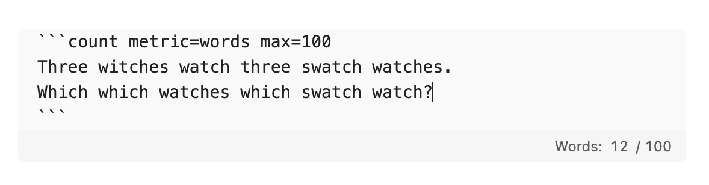

# Count Block


An Obsidian plugin for text-counting blocks. Add editable text blocks with a live counter beneath them.

The block lives with the rest of your Markdown content: it's really just a code block with its language set as `count`. This plugin displays a footer with its count (of whatever metric you get to choose) right below each block. No content is stored outside your vault.



## Metrics

Word count is the default metric, while more options are available. It can be changed globally in the plugin settings or per block with inline options.

- `words`: whitespace-separated words
- `characters`: Unicode code points, including whitespace
- `characters-no-spaces`: Unicode code points, excluding Unicode whitespace
- `utf8-bytes`: standard UTF-8 byte length
- `neis-bytes`: NEIS-style byte counting (a custom standard followed by Korean schools)

Block options belong on the opening fence and are not included in the count:

- `metric=<metric-id>`
- `min=<positive-integer>`
- `max=<positive-integer>`

The count is valid at either boundary. The footer will turn red if the text falls outside of the specified boundary.

Set optional default minimum and maximum values in the plugin settings. A block's `min=` or `max=` option overrides the corresponding default.

Example:

````markdown
```count metric=words min=200 max=500
Write plain text here.


````

Use the **Count Block: Insert** command to create a block or wrap selected text.

Invalid metrics, bounds, or option names are shown in the footer. A minimum above the maximum, or using `max=` together with `limit=`, is a configuration error. Top-level fenced blocks are supported in the initial release; nesting a count block inside a list or blockquote is not yet supported by the live editor footer.

### NEIS bytes

Yes this is a niche option, but is really the reason I built this thing. Korean schools happen to follow a weird counting method that counts Korean letters as three bytes, English as one and such. This differs significantly from standard byte counting, so a separate metric is needed.

Behavior follows the [NEIS counter](https://github.com/hjh010501/neis-counter): logical line breaks count as two bytes; its listed math, Greek, middle-dot, and curly-quote exceptions count as one byte; other characters use their UTF-8 byte length. CRLF and CR line endings are normalized to logical line breaks before counting.

## Roadmap

- [x] User-friendly dropdown controls & more
- [ ] i18n
- [ ] Custom metrics support (w. regex?)

I'd love to add support for custom metrics and more, but being quite occupied at the moment I'm not able to work on it right now. Will have my hands on it once I'm free.

## Feedback

If you happen to encounter any bugs or have feature requests, please [file an issue](https://github.com/lee-jongwoo/count-block/issues/new) on GitHub. Contributions are welcome as well.

## Development

```sh
npm install
npm test
npm run build
```

And then copy `main.js`, `manifest.json`, and `styles.css` to a test vault's `.obsidian/plugins/count-block/` directory. Reminder: never develop against your primary vault!
